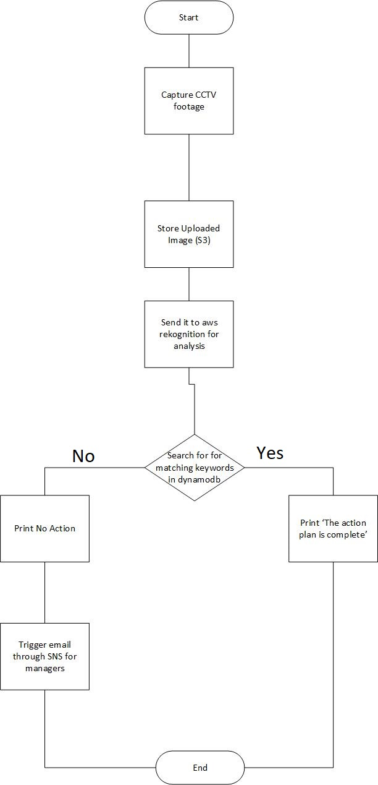
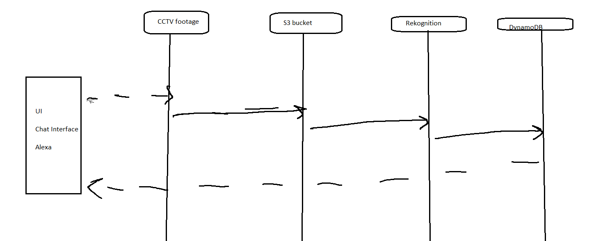
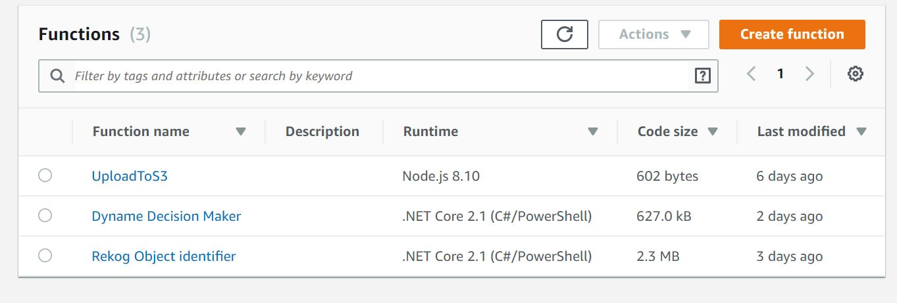
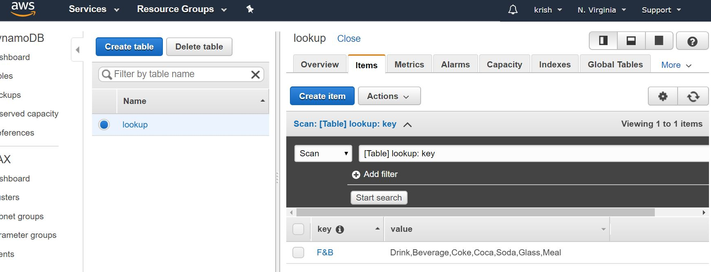

# Smart Inspect - Cumulus Challenge Idea

This document consists
* Mission Statement
* The high level architecture to build Smart Inspect
* Technologies used and why chose them

## Mission Statement

Please refer the executive presentation or the video attached in HackerEarth submissions.

## High Level Architecture

* Function as a Service (FaaS)


## Technologies used
* aws
* NodeJS
* C#/.Net


A Simple note
```
    All the technologies that are used in the hackathon are there not because they are new but because it suits our need  
    * We have decided to go with aws because AWS works with our requirements.
    * We have used NodeJS because we wanted our upload codebase to be simple.
    * We have used C# lambdas for concurrency and multi threaded operations.
```

## Flow Chart


## Flow Diagram


## Lambda Functions created


## DynamoDB lookup table


